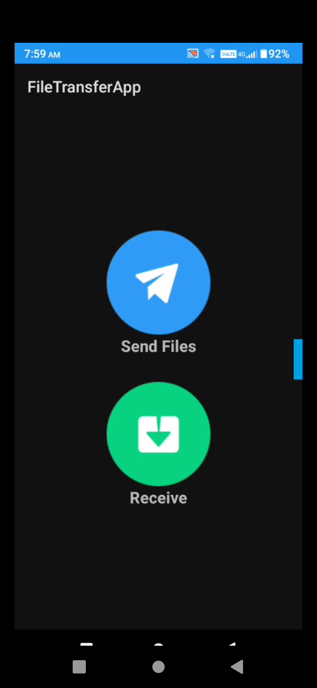
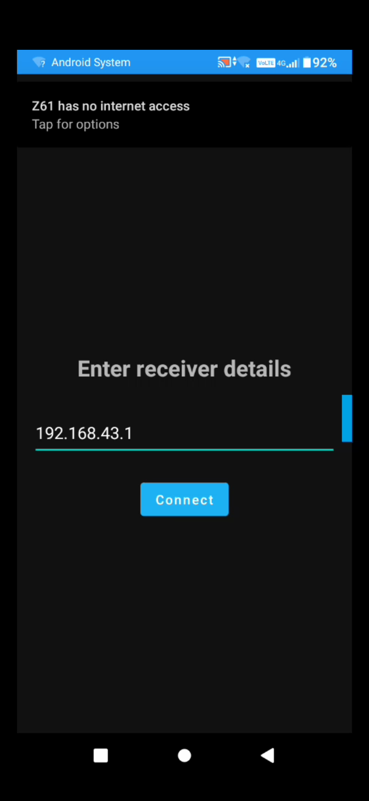
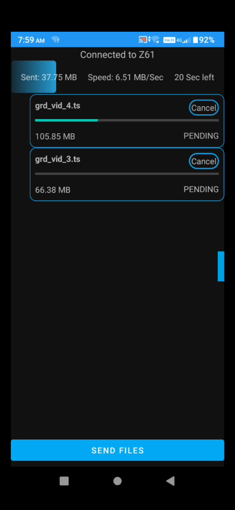
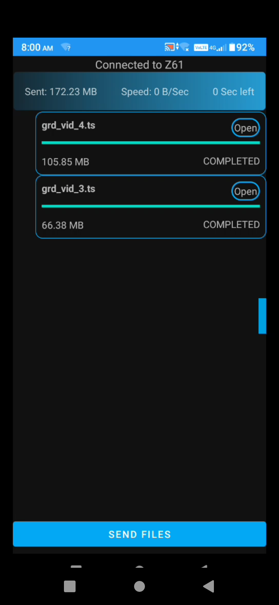

# 📲 Android LAN File Sharing App

An Android application to transfer files quickly and securely over a **local network (LAN)** — no internet required.

---

## 🚀 Features

- 📡 **High-speed file transfer** over Wi-Fi (7 MB/s on 2.4GHz, 40+ MB/s on 5GHz)
- 🔗 **No internet required** – works purely over local LAN (Wi-Fi / hotspot)
- 📁 **Send and receive any file type**
- 🌐 **Simple, intuitive UI**
- 🔒 Peer-to-peer using Java sockets (no cloud / 3rd party server)

---

## 🔄 How It Works

### 1. Setup Receiver
On the receiving device:
- Open the app
- Tap **"Receive"**
- The app will display the device’s local IP address
- Wait for the sender to connect

### 2. Setup Sender
On the sending device:
- Open the app
- Tap **"Send File"**
- Ensure both devices are on the **same Wi-Fi or hotspot**
- Enter the receiver’s IP address

### 3. Transfer Files
- Once connected, both devices switch to the **transfer screen**
- Select one or more files to send
- Monitor real-time **progress and speed**

---

## 📸 Screenshots

| Home Screen | Enter Receiver IP |
|-------------|-------------------|
|  |  |

| Transfer In Progress | Transfer Completed |
|----------------------|-------------------|
|  |  |

---

## 🛠️ Tech Stack

- **Android SDK**
- **Java Sockets** for direct peer-to-peer connection
- **Multithreading** for simultaneous file handling
- **HTTP Standards** for file packaging and transmission

---

## 📦 File Transfer Speeds

| Wi-Fi Band     | Typical Speed |
|----------------|----------------|
| 2.4 GHz        | ~7 MB/s        |
| 5 GHz / Hotspot| 40+ MB/s       |

---

## 📁 Project Structure

```
├── app/
├── screenshots/
│   ├── main.webp
│   ├── sender.webp
│   ├── transfer_screen.webp
│   └── transfer_completed.webp
├── README.md
```

---

## ✅ Future Enhancements

- 📡 QR-based IP sharing
- 🔄 Auto-discovery of peers on LAN
- 🔒 Encrypted file transfer
- 🖥️ Desktop companion app

---

## 🤝 Contributing

Pull requests are welcome. For major changes, please open an issue first to discuss what you would like to change.

---

## 📄 License

This project is licensed under the [MIT License](LICENSE).
